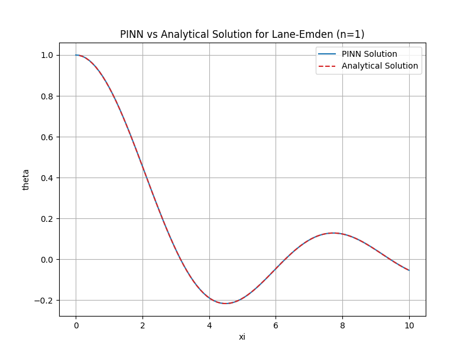

# Solving Lane-Emden with Physics-Informed Neural Networks (PINNs)

This project demonstrates how to solve the Lane-Emden equation using Physics-Informed Neural Networks (PINNs) in Python. The Lane-Emden equation is a second-order ordinary differential equation widely used in astrophysics to model the structure of polytropic stars.

## Features

- Implementation of PINNs to solve the Lane-Emden equation
- Customizable neural network architecture
- Logging and training scripts
- Pre-trained model checkpoint for n=2

## Project Structure

```
Solving_Lane-Emden_with_PINNs/
├── lane_emden.log              # Log file for training runs
├── logging_config.py           # Logging configuration
├── nn_architecture.py          # Neural network architecture definition
├── PINNn2.pth                  # Pre-trained model checkpoint
├── README.md                   # Project documentation
├── requirements.txt            # Python dependencies
├── single_case_trainer.py      # Script for single-case training
├── trainer.py                  # Main training script
├── LE_venv/                    # Python virtual environment
└── __pycache__/                # Python cache files
```

## Getting Started

### 1. Clone the Repository

```powershell
git clone https://github.com/mvphysics/Solving_Lane-Emden_with_PINNs.git
cd Solving_Lane-Emden_with_PINNs
```

### 2. Set Up the Python Environment

Create and activate the virtual environment (if not already present):

```powershell
python -m venv LE_venv
.\LE_venv\Scripts\Activate
```

### 3. Install Dependencies

```powershell
pip install -r requirements.txt
```

### 4. Run the Training Script

To run a single-case training:

```powershell
python single_case_trainer.py
```

## Results and Analysis

### 1. PINN Training Loss Curve


_This plot shows the training loss of the Physics-Informed Neural Network as it learns to solve the Lane-Emden equation for $n=1$. While the overall trend is downward, the presence of spikes in the loss curve suggests that the learning rate may be too high. Reducing the learning rate could lead to smoother convergence and potentially better results._

### 2. PINN Solution vs Analytical Solution


_This plot shows the final result of the PINN for $n=1$._

### 3. PINN vs Analytical Solution (Comparison Script)


_This figure, generated by the comparison script, overlays the PINN and analytical solutions for $n=1$. The excellent match between the two demonstrates that the trained PINN generalizes well and can reproduce the analytical result, further confirming the reliability of the PINN method for solving the Lane-Emden equation._

## Requirements

- Python 3.12+
- See `requirements.txt` for all dependencies

## References

- [Lane-Emden Equation - Wikipedia](https://en.wikipedia.org/wiki/Lane%E2%80%93Emden_equation)
- [Physics-Informed Neural Networks (PINNs)](https://en.wikipedia.org/wiki/Physics-informed_neural_networks)
